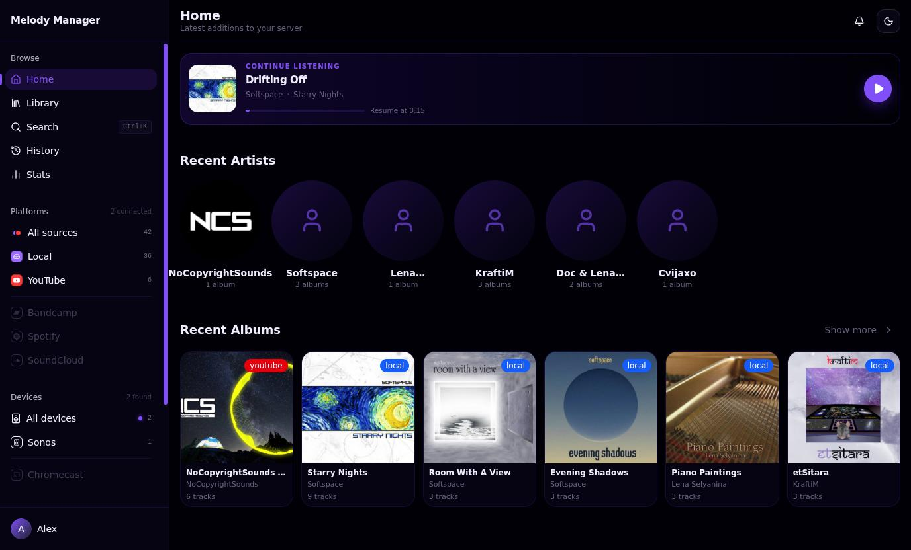
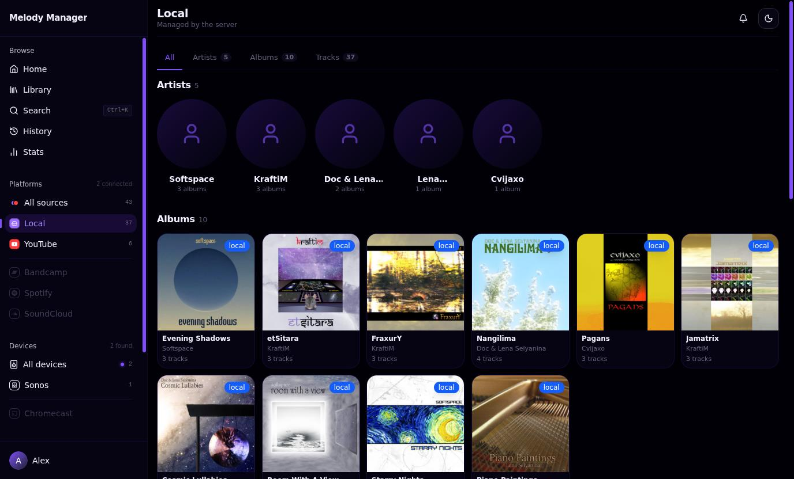
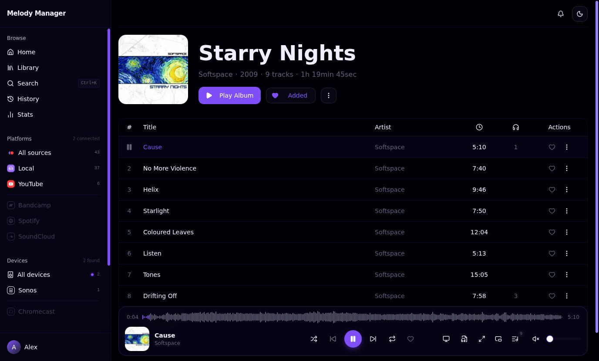
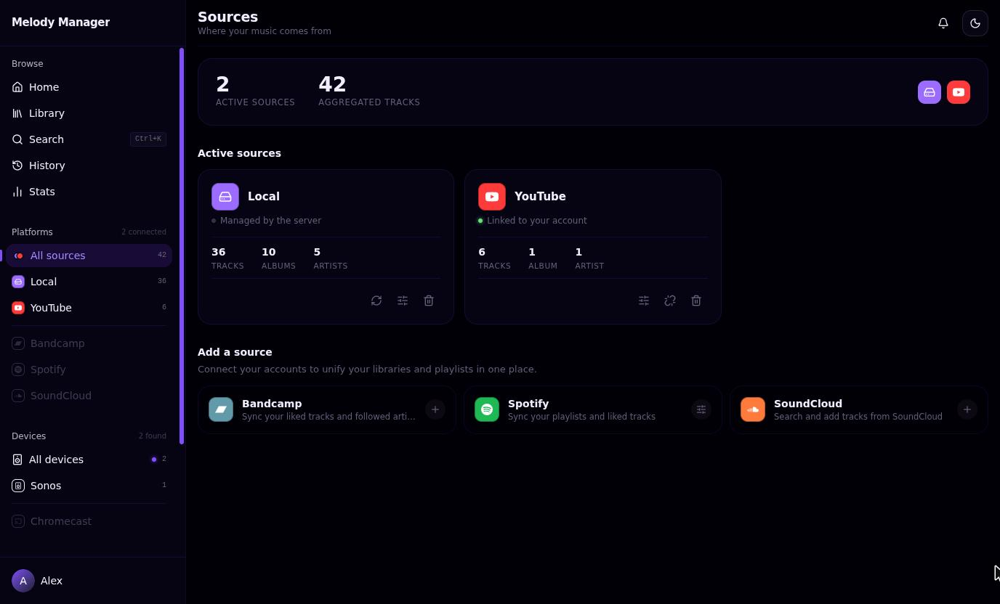
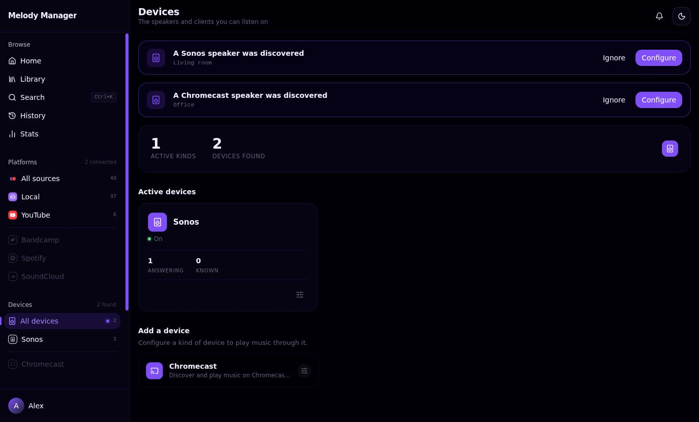

# Melody Manager

Your music, wherever it lives, in one place. Melody Manager brings together the
files on your server and what you follow on YouTube, Spotify, SoundCloud and
Bandcamp, then plays any of it in your browser or out loud on a Sonos speaker or
a Chromecast.

It runs on your own machine, in one container, and nothing about your library
leaves it.



## What it does

- **One library from several sources.** Local files are scanned and tagged from
  the folder you point at. The other sources are searched and imported alongside
  them, and a track from any of them plays the same way.
- **Plays where you are.** In the browser, in a window of its own outside the
  browser, or on a speaker on the network. Sonos and Chromecast speakers are
  discovered on their own; what a speaker cannot decode is transcoded on the way
  to it.
- **Yours to organise.** Albums, artists, playlists, likes, listening history and
  statistics, with covers resolved at import.
- **Several people, one server.** Each account has its own library, its own
  playlists and its own connections to the sources it uses.
- **English and French**, light and dark, and a progressive web app a phone can
  install from the browser. An Android build is attached to each release.

## Screenshots

| Browse a source | An album, playing |
|---|---|
|  |  |

Sources sit side by side, and a track from any of them plays the same way:



Speakers found on the network are offered as soon as they answer:



<sub>The library in these screenshots is made of releases from the Musictrade
netlabel by Softspace, KraftiM, Doc &amp; Lena Selyanina, Lena Selyanina and
Cvijaxo, published under
[CC BY](https://creativecommons.org/licenses/by/3.0/), alongside singles from
NoCopyrightSounds.</sub>

## Install

You need Docker. Create a folder for the install, put this in
`docker-compose.yml`, and mount the directory your music is in:

```yaml
services:
  melody-manager:
    image: ghcr.io/kevinbonnoron/melody-manager:latest
    container_name: melody-manager
    ports:
      - "8090:8090"
    volumes:
      - melody-manager-data:/app/pb_data
      - melody-manager-cache:/app/cache
      - ./config:/config
      # Your music, read-only. The path on the right is what you give the app.
      - /path/to/your/music:/music:ro
    restart: unless-stopped

volumes:
  melody-manager-data:
  melody-manager-cache:
```

Then:

```bash
docker compose up -d
```

Open <http://localhost:8090>. The first account you create is the administrator,
and sign-ups are closed after it unless you open them again from the settings.

Melody Manager runs on `linux/amd64` and `linux/arm64`, so a Raspberry Pi 4 or
newer will do.

## First run

1. **Create your account.** The first one becomes the administrator.
2. **Point the local source at your music.** The welcome screen lists every
   source; open **Local** and give it the path inside the container, `/music` in
   the compose file above. The folder is scanned straight away, and again
   whenever a file appears in it.
3. **Connect the sources you use.** YouTube, SoundCloud and Bandcamp need
   nothing but to be switched on. Spotify needs an application of your own; the
   [configuration guide](https://kevinbonnoron.github.io/melody-manager/guide/configuration)
   says where to get the credentials.

That is enough to listen. Everything else can wait until you want it.

## Playing on a speaker

A speaker fetches the audio from the server itself rather than through your
browser, so it has to be able to reach the server by an address that is not
`localhost`. Set that address once, under **Admin → Settings**, to the
one your machine has on the network (`http://192.168.1.20:8090`, say).

Sonos and Chromecast speakers are then discovered on their own and appear under
**Devices**. Discovery is multicast and multicast does not cross a router, which
includes a Docker bridge network despite the name, so either run the container
with `network_mode: host` or type the speaker's address in by hand. The
[devices guide](https://kevinbonnoron.github.io/melody-manager/guide/devices)
goes through both.

## Documentation

The full guides live at
**[kevinbonnoron.github.io/melody-manager](https://kevinbonnoron.github.io/melody-manager/)**:
installation, configuration, Docker, speakers and the HTTP API.

## Development

The repository ships a Nix dev shell with Go, Bun, Task, FFmpeg and yt-dlp. With
[direnv](https://direnv.net), `direnv allow` loads it; otherwise `nix develop`.

```bash
task dev
```

That runs the Go server on `http://localhost:8090` and the client on
`http://localhost:5173`. `task --list` has the rest: `build`, `lint`,
`type-check`, `test`, `test:e2e`, `desktop`.

The server is a single Go binary with [PocketBase](https://pocketbase.io)
embedded, serving the database, the authentication, its own `/api` endpoints and
the built [React](https://react.dev) client. The
[architecture notes](https://kevinbonnoron.github.io/melody-manager/guide/docker)
have the details.

## Licence

MIT. See [LICENSE](LICENSE).
